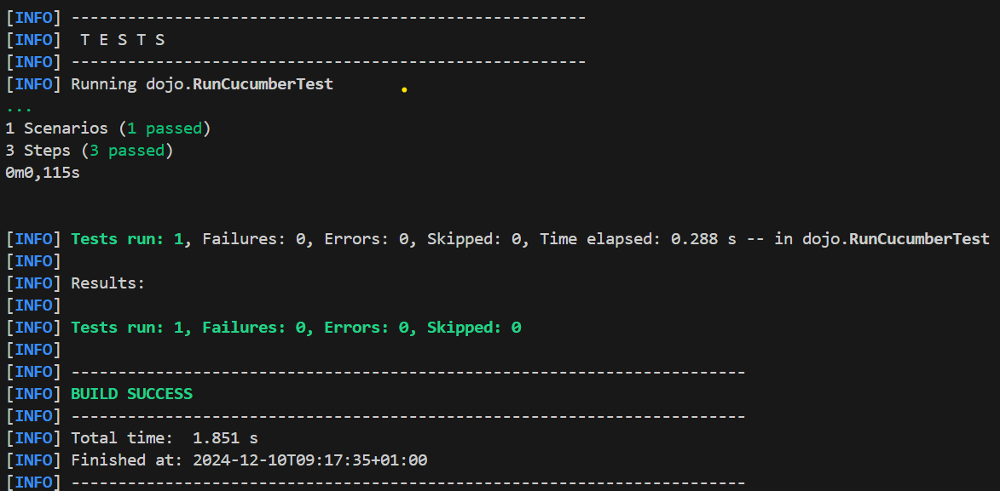

= R5.A.08 -- Dépôt pour les TPs
:icons: font
:MoSCoW: https://fr.wikipedia.org/wiki/M%C3%A9thode_MoSCoW[MoSCoW]

Ce dépôt concerne les rendus de mailto:guilherme.sampaio-teixeira@etu.univ-tlse2.fr[Guilherme Sampaio].

== TP1

.Feature

  Feature: Check if it's Friday
    Scenario Outline: Check if today is Friday
      Given today is "<day>"
      When I ask whether it's Friday yet
      Then I should be told "<answer>"
      Examples:
        | day            | answer |
        | Friday         | TGIF   |
        | Sunday         | Non    |
        | anything else! | Non    |

.Trace de succès du code
image::capture_success.png[width=80%]

== TP2

.Order
  class Order{
    private String owner;
    private String target;
    private List<String> cocktails = new ArrayList<String>();
    public void declareOwner(String owner){
        this.owner = owner;
    }
    public void declareTarget(String target){
        this.target = target;
    }
    public List<String> getCocktails(){
        return cocktails;
    }
  }

.Trace de succès du code

== TP3

Non complété, vous pouvez retrouver le code source dans le dossier `tp3`.
